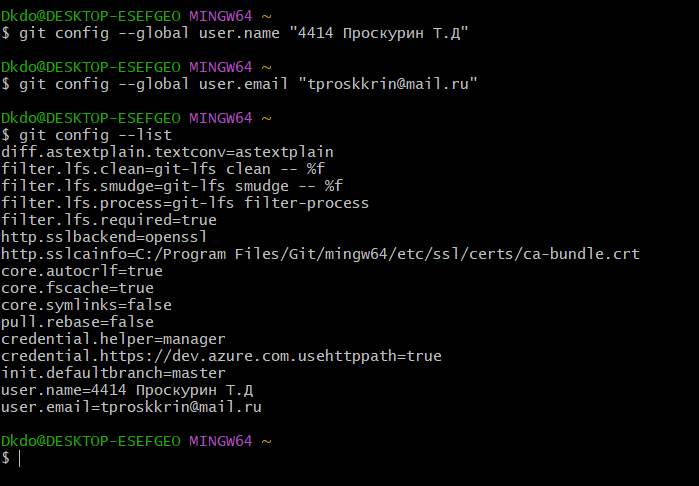

# Лабораторная работа: Изучение системы управления версиями Git

##Цель работы: Изучение базовых возможностей системы управления версиями, получение практического опыта работы
с Git API, локальным и удалённым репозиторием.

## Ход работы

### 1.Настройка Git клиента

**Выполненные действия:**
1. Открыл командную строку (Git Bash)
2. Выполнил настройку глобальных параметров

**Команды:**
git config --global user.name
git config --global user.email
 **Скриншот:**

### 2. Клонирование репозитория

**Выполненные действия:**
1. Открыл свой репозиторий на GitHub
2. Скопировал URL для клонирования
3. Выполнил клонирование в выбранную папку

**Команды:**
git clone https://github.com/Dkdo888/LR6-4414
cd LR6-4414

### 3. Добавление файла через GitHub

**Выполненные дейтсвия:**
1. Открыл свой репозиторий на GitHub
2. Нажал "Add file" → "Create new file"
3. Добавил содержимое файла

**Команды:**
git pull origin master

### 4. История операций

**Выполненные действия:**
1. Получил историю коммитов для всех веток
2. Просмотрел историю в графическом представлении
3. Изучил список всех веток

**Команды:**

git log --oneline --all
git log --graph --oneline --all
git branch -a

### 5. Просмотр изменений
**Выполненные действия:**
1. Просмотрел последний коммит
2. Сравнил изменения между коммитами
3. Проверил текущее состояние репозитория
**Команды:**
git show
git diff HEAD~1 HEAD
git status

### 6. Слияние веток
Создал тестовую ветку
git checkout -b feature-branch

Внес изменения в файл
Вернулся в master и внес конфликтующие изменения
git merge feature-branch
## Разрешение конфликта:
1. Открыл файл с помощью редактора Meld
2. Внес необходимые изменения
3. Объединил изменения из обоих веток

### 7. Удаление ветки
**Выполненные действия:**
1. Убедился, что слияние завершено успешно
2. Удалил ненужную ветку

**Команды:**
git branch -d feature-branch

### 8. Создание коммитов
**Выполненные действия:**
Создал серию коммитов с осмысленными комментариями

### 9. Откат коммита

**Выполненные действия:**
1. Просмотрел историю коммитов
2. Выполнил откат последнего коммита
3. Проверил изменения

**Команды:**
git log --oneline -3
git revert HEAD --no-edit
git log --oneline -3

### 10. Создание ветки для отчета

**Выполненные действия:**
1. Создал новую ветку для работы над отчетом
2. Переключился на созданную ветку

**Команды:**
git checkout -b report-branch
git checkout -b report-branch

### 11. История операций
**Получение истории:**
git log --pretty=format:"%h %ad %an %s" --date=short
debdf2e 2025-11-18 Timofei Proskurin Добавление скриншотов 2
146afdc 2025-11-18 Timofei Proskurin Update README.md
b26e0fc 2025-11-18 4414 Проскурин Т.Д Добавлен пункт 10 - создание ветки для отчета
b7badc4 2025-11-18 4414 Проскурин Т.Д Добавлены скриншоты
c93602b 2025-11-18 4414 Проскурин Т.Д Добавление скриншотов
8ec1a4d 2025-11-18 4414 Проскурин Т.Д Добавлен пункт 9 - откат коммита
570c841 2025-11-18 4414 Проскурин Т.Д Добавлен пункт 8 - создание нескольких коммитов
1c4f0a3 2025-11-18 4414 Проскурин Т.Д Добавлен пункт 7 - удаление ветки
a0b5669 2025-11-18 4414 Проскурин Т.Д Добавлен пункт 6 - слияние веток с разрешением конфликта
0de42fa 2025-11-18 4414 Проскурин Т.Д Добавлен пункт 5 - просмотр изменений
2a81a52 2025-11-18 4414 Проскурин Т.Д Добавлен пункт 4 - история операций
e030a2a 2025-11-18 4414 Проскурин Т.Д Добавлен пункт 3 - добавление файла через GitHub
d728102 2025-11-18 4414 Проскурин Т.Д Merge branch 'report-branch' of https://github.com/Dkdo888/LR6-4414 into report-branch
ecb48a5 2025-11-18 4414 Проскурин Т.Д ДДобавление пункта 3 - добавление файла через GitHub
409120b 2025-11-18 Timofei Proskurin Исправление опечаток второго пункта
772e16a 2025-11-18 4414 Проскурин Т.Д Добавлен пункт 2 - Клонирование репозитория
816fd8c 2025-11-18 4414 Проскурин Т.Д Добавлен пункт 1 - настройка Git клиента
9da42b6 2025-11-18 4414 Проскурин Т.Д Создана базовая структура отчета и папка для скриншотов
f8fb16c 2025-11-17 4414 Проскурин Т.Д Устранен конфликт
54b8b66 2025-11-17 4414 Проскурин Т.Д Разрешение конфликта слияния с feature-branch с помощью Meld
9040cbb 2025-11-17 4414 Проскурин Т.Д Revert "Добавление цели работы"
510896b 2025-11-17 4414 Проскурин Т.Д Добавление цели работы
cb82317 2025-11-17 4414 Проскурин Т.Д Создание начальной структуры README
da5685b 2025-11-17 4414 Проскурин Т.Д Успешное слияние с разрешенным конфликтом
5bdcfe5 2025-11-17 4414 Проскурин Т.Д Добавление содержимого из второй ветки
a38ddfe 2025-11-17 4414 Проскурин Т.Д Добавление содержимого из первой ветки
4539015 2025-11-17 Timofei Proskurin Добавление файла
88401b1 2025-11-17 Timofei Proskurin Create file
921f53b 2020-11-21 Kurtyanik Обновление информации
c08a654 2020-11-21 Kurtyanik Файл создан пустым
3c6e913 2020-11-21 Kurtyanik Initial commit### 12. Отправка изменений

**Выполненные действия:**
1. Отправил локальные изменения в удаленный репозиторий
2. Проверил наличие изменений на GitHub

**Команды:**
git push -u origin report-branch
### Выводы:
В ходе выполнения лабораторной работы были успешно изучены и практически освоены основные возможности системы управления версиями Git
